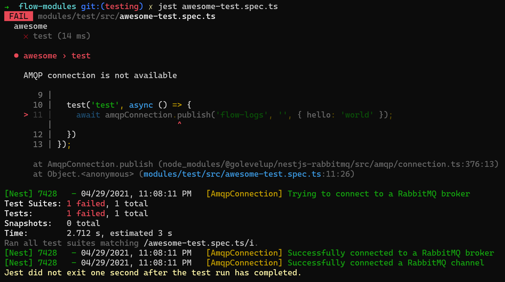

# Development Environment

This guide includes everything you need to install or setup to develop Flow-Modules.

The first part will be all the tools you need to install, the second part
will be about the dependencies for both Typescript and Python. The last part will 
be about common errors that may occur when starting to develop a Flow-Module.

# Basic Tools

## NodeJS
To run Javascript/Typescript code you need the NodeJS runtime. Available to download [here](https://nodejs.org/en/). 

You will need at least version 12 to use the dependencies needed. We however recommend to use version 14
instead. This will help prevent problems with Node-version or OS-version specific dependencies, as the 
Flow-Executor of the HahnPRO Cloud uses Node-version 14 on linux. Most packages on [npm](https://www.npmjs.com/) 
are cross-platform, but there are also the ones which require the Node-version of the development/build environment 
to be same as the version in the execution environment.

## Python 
This part can be skipped if you do not intend to use Python scripts in your Flow-Function.

The Python code has to be run in a Python-interpreter. Available [here](https://www.python.org/downloads/)
The Flow-Executor runs version 3.8, therefore we recommend running this version in the development environment
as well. 

## RabbitMQ
This part can be skipped if you do not intend to use Python scripts in your Flow-Function.

When using the RPC pattern to integrate a Python script, the Typescript-part and Python-part of the
Flow-Function communicate over RabbitMQ. 
There are multiple ways to install RabbitMQ, the most flexible is to run it as a container in a container
runtime like Docker. This will require you to install [Docker](https://www.docker.com/). This might seem
overkill for just running a single service, but Docker offers the flexibility to easily run different
services like databases or other dev-tools like IPython Notebooks in the future. 

To run the RabbitMQ container-image in Docker run:

`docker run -it --rm --name rabbitmq -p 5672:5672 -p 15672:15672 rabbitmq:3-management`

If you do not want to install Docker, you can choose a different way to install RabbitMQ 
[here](https://www.rabbitmq.com/download.html). 

# Dependencies

## Typescript
To develop Flow-Functions the Hahn-PRO [Flow-SDK](https://www.npmjs.com/package/@hahnpro/flow-sdk)
and [Flow-CLI](https://www.npmjs.com/package/@hahnpro/flow-cli) are required. The SDK provides all
the classes and types needed in a Flow-Function.
The CLI can be used to test, package and update the Flow-Modules in the Cloud. To use the CLI you 
should install it globally on your system (`npm i -g @hahnpro/flow-cli`).

## Python
The only dependency needed is [`aio-pika`](https://pypi.org/project/aio-pika/). It is needed for 
the RabbitMQ connection used in the RPC-style Python integration.

## Configuration

### Jest config
For testing of the Flow-Functions the CLI internally uses [Jest](https://www.npmjs.com/package/jest).
Jest can only run Javascript code, therefore tests written in Typescript need to be transpiled before
running them. Jest can do this automatically, if it is configured to do so. For this a `jest.config.js`
file is needed. An example for this file can be found [here](../examples/jest.config.js).

### Typescript config
When using Typescript a `tsconfig.json` is needed. This file configures the Javascript-to-Typescript
transpiler. This file will also be used by the Jest config. An example file can be found 
[here](../examples/tsconfig.json).

# Common Errors
When first setting up the environment it is easy to miss a step or configuring a tool wrongly. Here are
some of the most common errors that can occur, what causes them and how to fix them.

## Jest config Errors

### No Tests Found 


This error is caused by a wrongly configured `testRegex` or `testPathIgnorePatterns` attribute in the 
config. 

`testRegex` defines which filenames should be considered. In this case this Regex is used.
```
(/test/.*|(\.|/)(test|spec))\.(ts|js)x?$
```
It matches everything that ends with `.spec.ts`, `.test.ts`, `.spec.js`, `.test.js`, the React
`.jsx` and `.tsx` fileformat variants of those and every `.ts`, `.js`, `.tsx` and `.jsx` file in the
`test` directory.
You can test your filenames [here](https://regex101.com/r/JXRLlM/1).

`testPathIgnorePatterns` determines which files or directories should not be considered by Jest.
Here the three Regexes `/dist/`, `/node_modules/` and `/modules/` are used. These match their names
exactly. Therefore, everything in the `node_modules`, `dist` and `modules` is ignored.

As the test-files are in the `modules` directory, no tests were found. After removing the `/modules/` 
pattern from `testPathIgnorePatterns` the tests are found and executed. 

### Unexpected Syntax Errors


First you should check if there actually are no syntactical errors in your code.

This can also be caused by a wrong Typescript configuration in the Jest Config. 
As Jest can only run tests in Javascript, Typescript tests have to be transpiled first. 

The `transform` option defines a Regex, and the handler for files that need to be transformed before
testing. You could define multiple Regexes with multiple handlers, but here you only need a config for
`.ts` and `.tsx` files. 

The following definitions configures Jest to use the `ts-jest` pre-processor on Typescript files.
```
transform: {
    '^.+\\.tsx?$': 'ts-jest',
  },
```
`ts-jest` will look for the `tsconfig.json` in the same directory as the `jest.config.js` by default.
By adding a `ts-jest` config in the `globals` section of the `jest.config.js` you can configure a 
different path for the `tsconfig.json`.

```
globals: {
  'ts-jest': {
    tsconfig: 'tsconfig.json',
  },
},
```

## Rabbitmq Connection Errors

### Connection not available


In this case the test tried to connect to the Rabbitmq Broker, but it was not available on 
`amqp://localhost:5672`.

To fix this:
- make sure the Broker is running 
- port 5672 is forwarded (this should be the case when using it in docker using the command mentioned above)

### Connection successful but still Connection not available error

Consider the following example-test:

```typescript
import { AmqpConnection } from '@golevelup/nestjs-rabbitmq';

describe('awesome', () => {
  let amqpConnection: AmqpConnection;
  beforeAll(() => {
    amqpConnection = new AmqpConnection({ uri: 'amqp://localhost' });
    amqpConnection.init();
  });

  test('test', async () => {
    await amqpConnection.publish('flow-logs', '', { hello: 'world' });
  });
});
```

This test connects to a Rabbitmq Broker and then publishes a message.
(In a normal Flow-Function test you won´t do this explicitly, but internally the Flow-SDK
does something similar and will cause the same error)

When running this test, you will get the following error:



The logs show that the connection was established successfully, but still a Connection not available error
is raised.

This is caused by a missing `await` before the `amqpConnection.init()`. Connecting to the broker is
task that can take some time. Here the test started to run before the connection was fully established.
It therefore failed to publish the message. Only after the actual test-case ran and failed is the 
connection fully established. 

By correcting the `beforeAll` in the following way the test will work as expected.

```typescript
beforeAll(async () => {
  amqpConnection = new AmqpConnection({ uri: 'amqp://localhost' });
  await amqpConnection.init();
});
```

## Wrong Dependency version for Executor
While building a Flow-Module all the dependencies get bundled into the `.zip` file, that gets
uploaded to the cloud. This can cause problems if you are not developing on linux or with a different
NodeJS version than the Flow-Executor.

These errors will only occur when deploying a Flow in the cloud.

### Windows specific binaries
The majority of modules available for installation on [npm](https://www.npmjs.com/) are cross-platform
compatible and therefore don´t need extra care. 

There are also some modules like [tensorflow-node](https://www.npmjs.com/package/@tensorflow/tfjs-node) 
or [sharp](https://www.npmjs.com/package/sharp), that are wrappers for an underlying binary. These
binaries tend to be platform-specific. So when bundling the dependencies on Windows, the windows specific
binary is bundled which will not work on the linux based Flow-Executor. 

To fix this you have to install the [Linux Subsystem for Windows](https://docs.microsoft.com/en-us/windows/wsl/install-win10).
Then install NodeJS and the Javascript/Typescript dependencies and build the module in a linux-like
environment. This will then bundle the correct version.

### Different Node-version on development machine
There are some modules that are Node-version specific. This can cause errors like the following:

```
Error: 
The module '/some/cool/module.node' was compiled against a different Node.js version using
NODE_MODULE_VERSION 51. This version of Node.js requires
NODE_MODULE_VERSION 57. Please try re-compiling or re-installing
```

This is caused by running a different Node-version on the development-machine than in the Executor.
When installing the dependency the correct version for the dev-machine is installed, which then gets
bundled and uploaded to the cloud. 

To fix this, you need to install the correct Node-version on your system on which you are building
the module. 